# Camping Website

A responsive multi-page camping website built using HTML, CSS, and JavaScript.  
Along with index.html (main page) it includes Camping Gear page, Gallery page, FAQ page , Lost & Found page, and legal pages (Disclaimer, Privacy Policy, Terms & Conditions).

## Features
- Multi-page responsive layout.
- Smooth scrolling navigation.
- Image and video gallery.
- FAQ and Lost & Found pages.
- Legal pages (Disclaimer, Privacy, Terms)

## Technologies Used
- HTML5, CSS3, JavaScript.
- Git & GitHub for version control.
- Netlify for deployment.
- GitHub as backup for deployment.

## Development Log
- Project planning and wireframing.
- Coding individual pages (HTML/CSS/JS).
- Used sites linke Pexels, unsplash etc for images and videos.
- Implemented responsive design for desktop and mobile.
- Fixed anchor link issues using GitHub Pages.
- used Netlify for hosting.
- Tested links, forms, and gallery functionality.
- Final deployment and testing.

## Deployment
-Live site: https://camping-website-html-css-js.netlify.app/
-backup github live: https://ankitwaghinkar.github.io/Camping-website-using-HTML-CSS-and-JavaScript/

## Screenshots

### Home Page
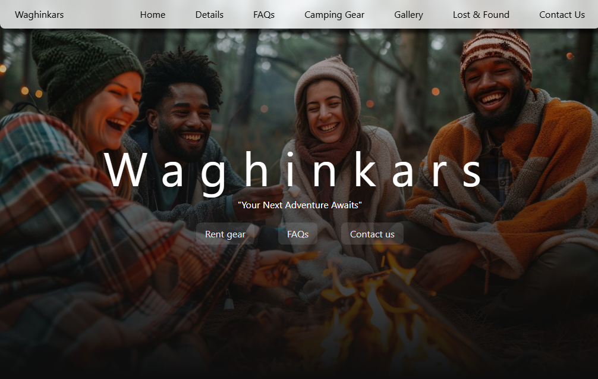 

---

### Details Page
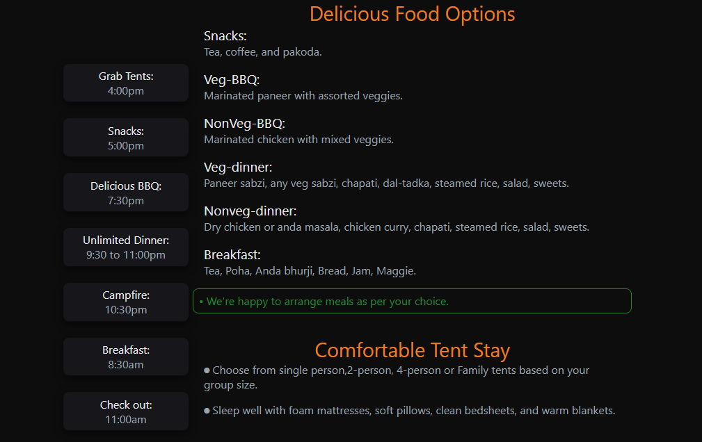  

---

### Camping Gear Page
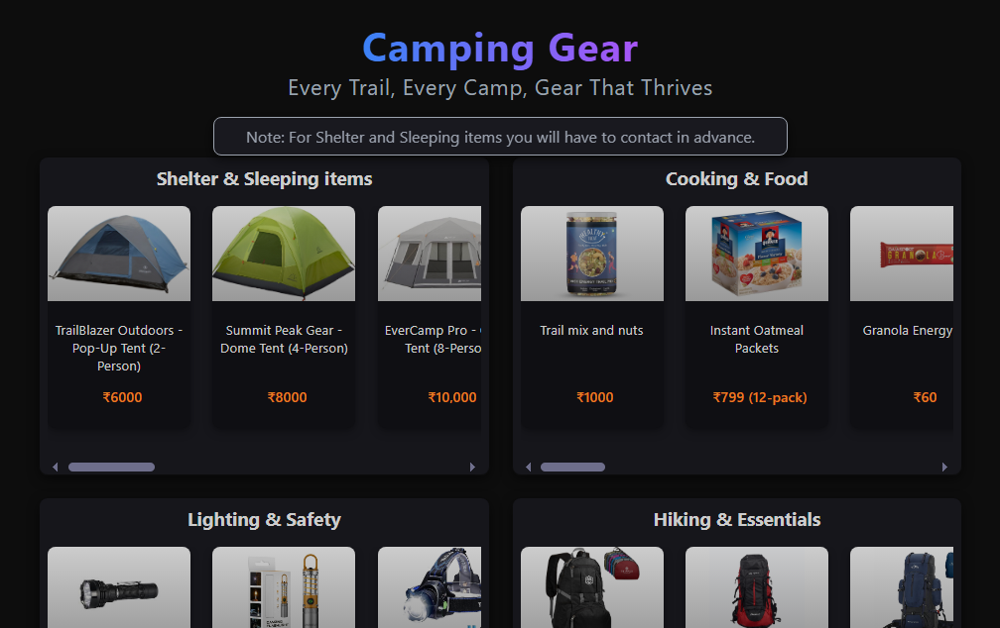  

---

### Booking Page
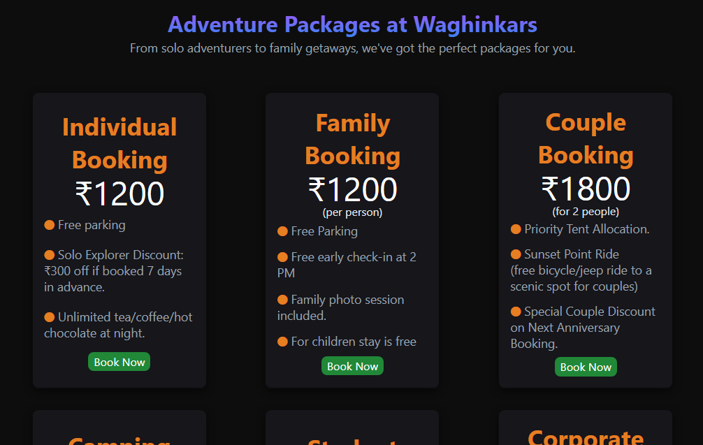  

---

### Gallery Page
  

---

### About Us Page
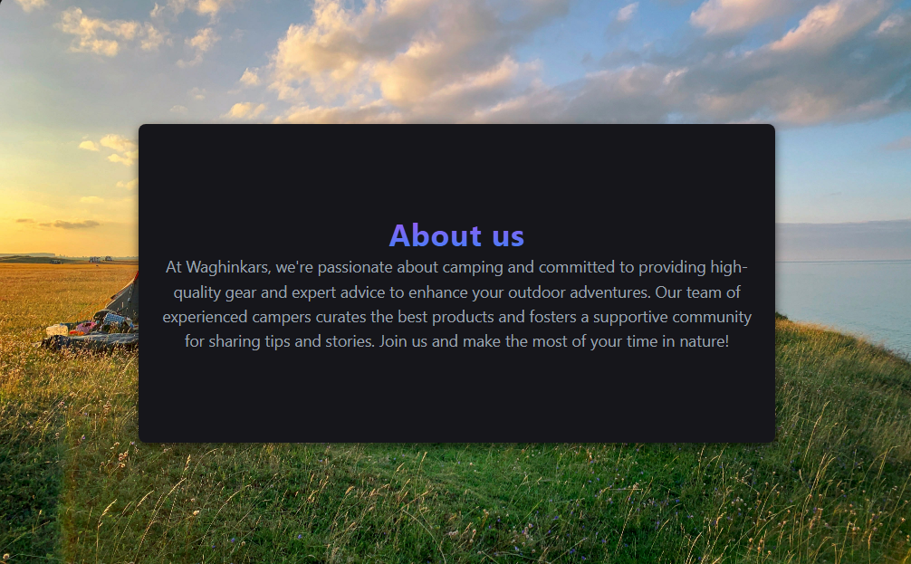  

---

### Contact Us Page
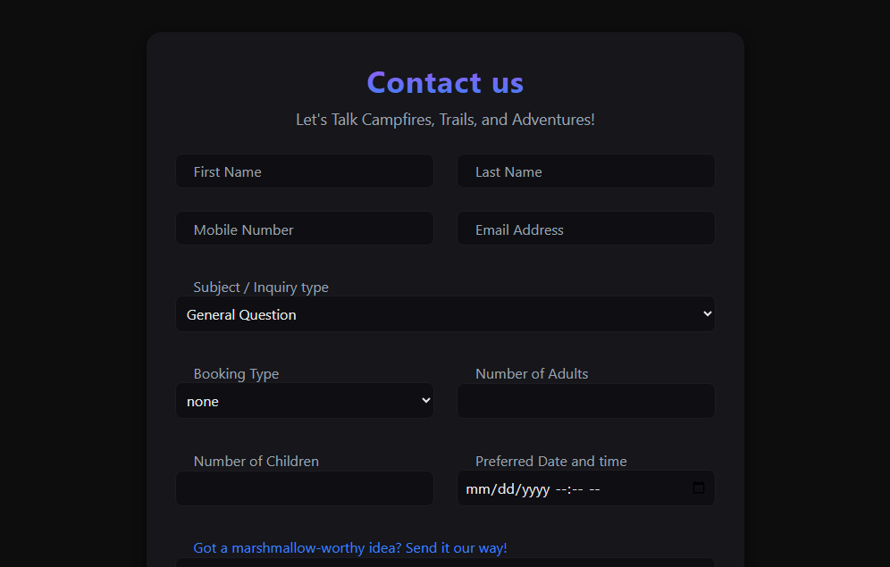  

---

### FAQ Page
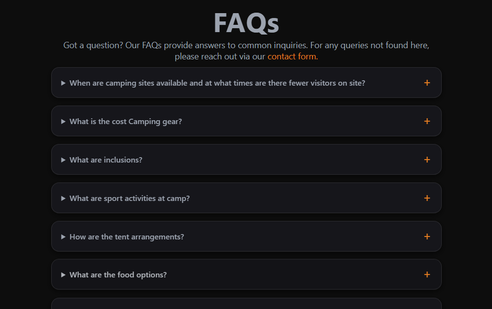  

---

### Lost & Found Page
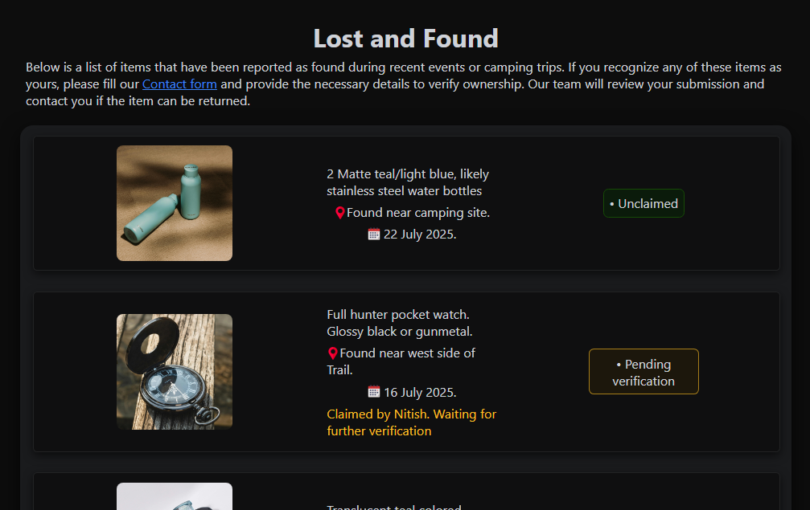  

---

### Disclaimer Page
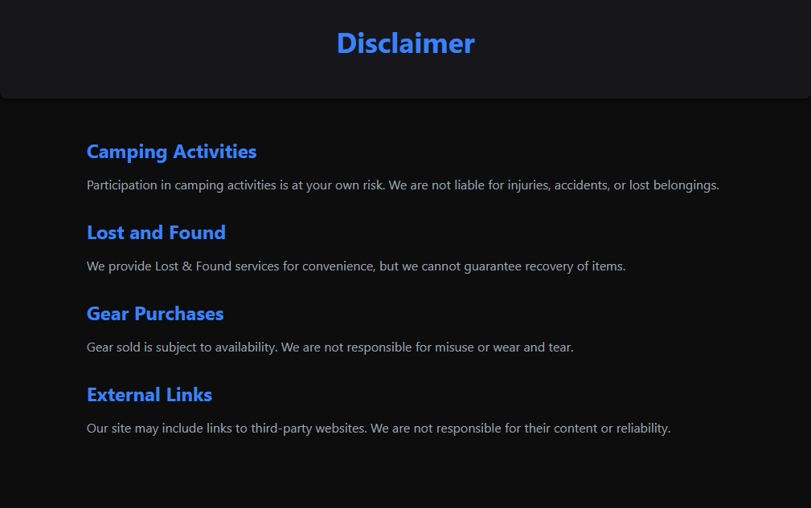  

---

### Privacy Policy Page
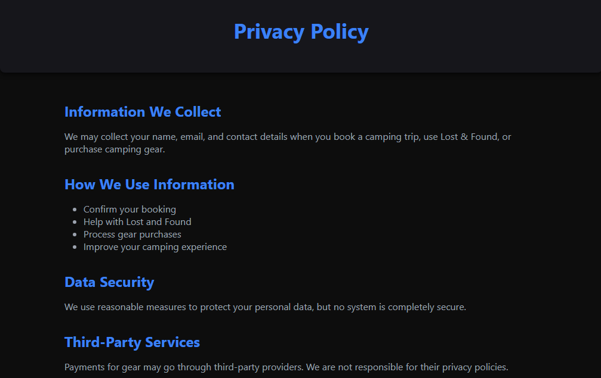  

---

### Terms & Conditions Page
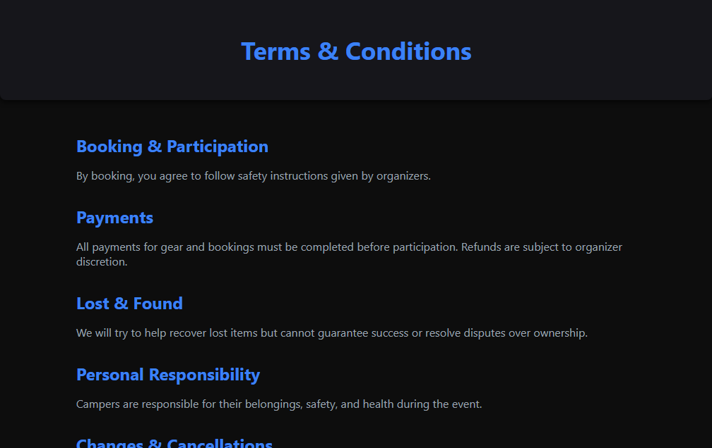  

---

## Challenges
- Anchor links were not working → resolved.
- Hosting website → used Netlify.
- Mobile responsiveness → implemented media queries
